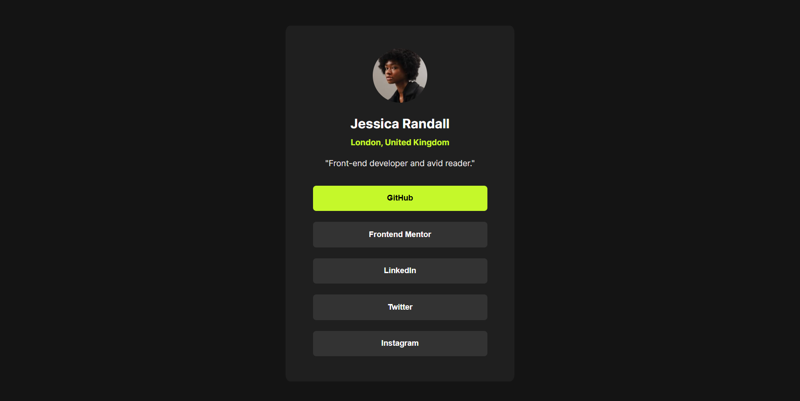

 # Frontend Mentor - Social links profile card solution

This is a solution to the [Social links profile card challenge on Frontend Mentor](https://www.frontendmentor.io/challenges/social-links-profile-card). Frontend Mentor challenges help you improve your coding skills by building realistic projects.

## Table of contents

- [Overview](#overview)
  - [The challenge](#the-challenge)
  - [Screenshot](#screenshot)
  - [Links](#links)
- [My process](#my-process)
  - [Built with](#built-with)
  - [What I learned](#what-i-learned)
  - [Continued development](#continued-development)
  - [Useful resources](#useful-resources)
- [Author](#author)


## Overview

### The challenge

Users should be able to:

- See hover and focus states for all interactive elements on the page

### Screenshot



### Links

- Solution URL: [My Solution](https://github.com/Akansha82/social-links-profile-card)
- Live Site URL: [Live Site](https://akansha82.github.io/social-links-profile-card/)

## My process

### Built with

- Semantic HTML5 markup
- CSS custom properties
- Flexbox
- Mobile-first workflow

### What I learned

Working on this project helped me understand how to center elements using Flexbox and how to create a vertical layout for buttons using Flexbox. I also learned how to use the `box-shadow` property to create shadow effects that add depth to elements.

Here's a snippet of code I'm proud of:

``` css
.card-link {
   align-items: center;
    display: flex;
    flex-direction: column;
    gap: 20px; 
    margin-top: 8%;
  }
  
  .card-btn {
    width: 80%; 
    padding: 15px;
    background-color: hsl(0, 0%, 20%);
    color: #fff;
    border: none;
    border-radius: 6px;
    font-size: 0.9rem;
    font-weight: 700;
    text-align: center;
    cursor: pointer;
  } 
  
This CSS centers the .container both horizontally and vertically within the viewport.
```

### Continued development

In future projects, I plan to:

- Improve accessibility features by using more ARIA roles and attributes.
- Explore advanced CSS techniques such as CSS Grid for more complex layouts.
- Enhance my JavaScript skills to add interactivity to web pages.

### Useful resources

- [MDN Web Docs](https://developer.mozilla.org/en-US/docs/Web) - Comprehensive documentation and tutorials.
- [CSS-Tricks](https://css-tricks.com/) - A great resource for learning about Flexbox and other CSS techniques.
- [Frontend Mentor](https://www.frontendmentor.io/challenges) - Provides real-world coding challenges.


## Author
- Frontend Mentor - [@Akansha82](https://www.frontendmentor.io/profile/Akansha82)